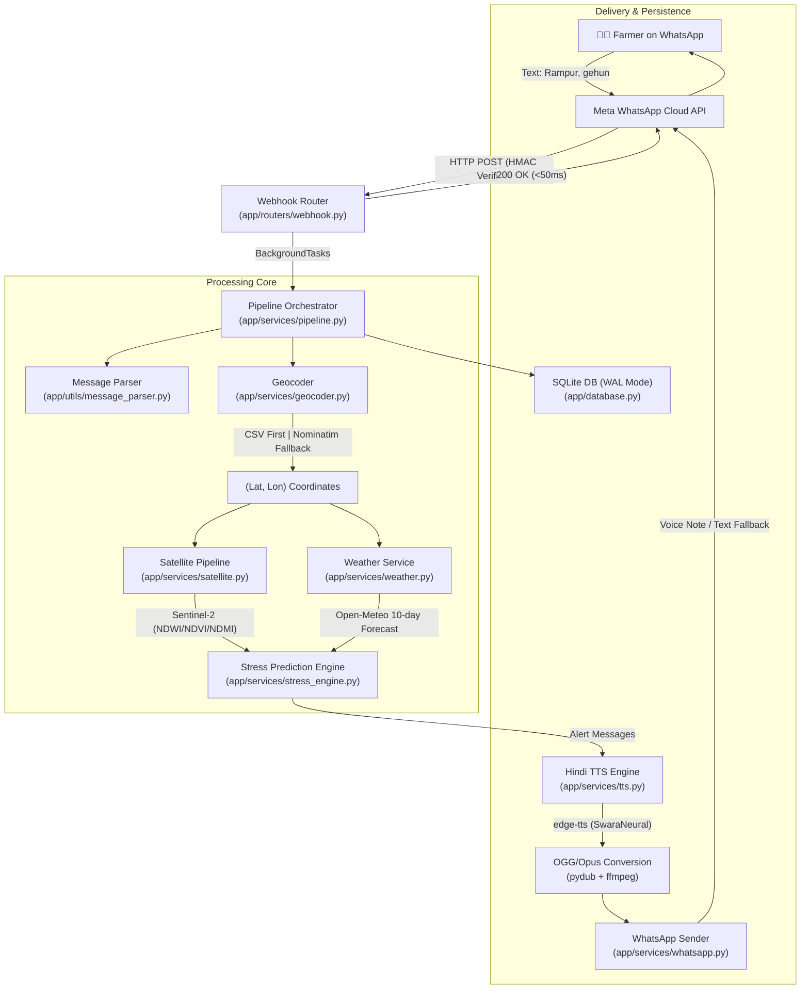

# 🌾 JalSense 2.0 Backend

JalSense 2.0 is an intelligent water stress forecasting and warning system designed to help Indian smallholder farmers optimize irrigation. By combining cloud-based satellite data processing, local weather forecasting, and automated voice alerts, JalSense delivers actionable irrigation advice directly to farmers via **WhatsApp voice notes in Romanized Hindi and Devanagari**.

The backend is built using **FastAPI** (Python 3.9+) and features a robust, resilient multi-service pipeline optimized for hackathon demo reliability and production-grade security.

---

## 🏗️ System Architecture

The following diagram illustrates the complete end-to-end pipeline:



---

## 🚀 Key Features & Service Modules

### 1. Centralized Pipeline Orchestration ([pipeline.py](file:///c:/National/app/services/pipeline.py))
Ties all microservices together. Every single stage in the pipeline is wrapped in error boundaries with robust default fallbacks. **The pipeline never crashes**, ensuring the farmer always receives either their voice note or a textual fallback apology if external APIs fail.

### 2. Intelligent Message Parser ([message_parser.py](file:///c:/National/app/utils/message_parser.py))
Handles raw text inputs in Romanized Hindi, English, and Devanagari (e.g., `"Chitrakoot, gehun"`, `"Rampur dhan"`, `"चित्रकूट, गेहूं"`). Uses **Levenshtein distance (threshold $\le$ 2)** to resolve crop typos and dictionary matching to isolate multi-word village names.

### 3. Resilient Geocoder ([geocoder.py](file:///c:/National/app/services/geocoder.py))
A hybrid geocoding engine:
1. **Local CSV Lookup** (instant and 100% reliable for demo villages).
2. **Nominatim OpenStreetMap API** (fallback for unknown villages with request buffering).

### 4. 3-Tier Satellite Caching ([satellite.py](file:///c:/National/app/services/satellite.py))
Calls **Google Earth Engine (GEE)** to acquire Sentinel-2 Harmonized imagery. It filters cloud cover < 20%, applies QA60 masking, and extracts:
*   **NDWI** (Normalized Difference Water Index) — Soil moisture indicator.
*   **NDVI** (Normalized Difference Vegetation Index) — Canopy greenness.
*   **NDMI** (Normalized Difference Moisture Index) — Crop tissue dehydration.

To survive GEE concurrency and quota limits during demos, it uses a **3-tier cache**:
`In-Memory TTLCache` $\rightarrow$ `Local Precomputed demo_cache.json` $\rightarrow$ `Live GEE API calls`.

### 5. Async Weather Service ([weather.py](file:///c:/National/app/services/weather.py))
Fetches 10-day precipitation, temperature ranges, and rain probability using `httpx` from **Open-Meteo** (no API keys required). Features an 11km grid-based cache to group nearby farmers.

### 6. Crop Stress Engine ([stress_engine.py](file:///c:/National/app/services/stress_engine.py))
Combines satellite indexes with weather modifiers:
*   *Rain Advisory Override*: Downgrades alerts if heavy rain ($\ge$ 2mm) is expected within 3 days.
*   *Heatwave Trigger*: Escalates alerts if temperatures exceed 42°C.
*   *Weather-only Fallback*: Generates Mausam-based alerts if clouds mask satellite imagery.

### 7. Hindi TTS & Audio OGG/Opus conversion ([tts.py](file:///c:/National/app/services/tts.py))
Utilizes Microsoft Edge Neural TTS (`hi-IN-SwaraNeural`) to render natural-sounding Hindi voice notes. Generates an MP3 and converts it dynamically to **OGG/Opus** (using `pydub` + `ffmpeg`) to render native voice notes in the WhatsApp UI.

---

## 🔒 Security, Tracking & Robustness (Hackathon Upgrades)

JalSense 2.0 includes several production-grade safeguards specifically designed to impress hackathon judges:

1.  **Async Webhook Processing**: Webhooks return a HTTP `200 OK` in `< 50ms`. Heavy services (GEE, weather, TTS) are dispatched to FastAPI `BackgroundTasks`. This prevents Meta's webhook servers from timing out (20s) and retrying, which causes duplicate voice notes.
2.  **Message Deduplication**: Employs a sliding-window message deduplicator ([dedup.py](file:///c:/National/app/utils/dedup.py)) to discard duplicate delivery retry events from Meta.
3.  **Spoofing Protection (HMAC-SHA256)**: Webhook endpoints extract the `X-Hub-Signature-256` header, validating that incoming messages are signed by Meta using your App Secret.
4.  **Demo Endpoint Rate Limiting**: The public `/api/demo` endpoint (used by the dashboard panel) is restricted using `slowapi` to **10 requests per minute per IP** to prevent quota exhaustion attacks.
5.  **PII Privacy Masking**: Logs automatically mask farmer phone numbers into `********1234` formatting across all services.
6.  **Structured Log Tracing (Correlation IDs)**: Integrates custom middleware that injects an 8-character request UUID into all log records, which propagates seamlessly from HTTP endpoints to background processing tasks.
7.  **Startup Health Checks & Self-Healing**: Checks for database integrity, GEE initialization, and `ffmpeg` availability on startup. It automatically detects and binds WinGet paths for Gyan's FFmpeg binary to `os.environ["PATH"]` dynamically.
8.  **SQLite WAL Mode**: Configures Write-Ahead Logging (WAL) and a 30s busy timeout to prevent write locks during concurrent farmer requests.

---

## 🚀 Installation & Running

### 1. Prerequisites
*   **Python 3.9+** (Tested on Python 3.9.6)
*   **FFmpeg** (Required for audio conversion to native WhatsApp voice note format):
    *   **Windows**: `winget install Gyan.FFmpeg`
    *   **Ubuntu/Debian**: `sudo apt update && sudo apt install -y ffmpeg`
    *   **Mac**: `brew install ffmpeg`

### 2. Clone and Install Dependencies
```bash
# Install packages
pip install -r requirements.txt
```

### 3. Configuration Setup
Create a `.env` file in the root directory (based on `.env.example`):
```env
# --- Google Earth Engine ---
GEE_SERVICE_ACCOUNT_EMAIL=your-sa@your-project.iam.gserviceaccount.com
GEE_KEY_FILE_PATH=./gee-key.json
GEE_PROJECT_ID=your-gcp-project-id

# --- WhatsApp Cloud API ---
WHATSAPP_ACCESS_TOKEN=your-meta-access-token
WHATSAPP_PHONE_NUMBER_ID=your-phone-number-id
WHATSAPP_VERIFY_TOKEN=your-webhook-verify-token
WHATSAPP_APP_SECRET=your-meta-app-secret-optional-for-local-dev

# --- Database ---
DATABASE_URL=sqlite:///./jalsense.db

# --- Dashboard Security ---
DASHBOARD_API_KEY=jalsense-demo-2026
```

### 4. Running the Test Suite
Ensure that all unit tests pass before serving traffic:
```bash
python -m pytest
```

### 5. Running the API Server
Start the Uvicorn reloading development server:
```bash
uvicorn app.main:app --reload
```

---

## 🏥 Verification & API Inspection

### Health Check
Verify your dependencies, GEE connection status, and FFmpeg capability via:
```bash
# Request
curl http://localhost:8000/health

# Healthy Response
{
  "status": "healthy",
  "checks": {
    "gee_connected": true,
    "ffmpeg_available": true,
    "whatsapp_configured": true
  },
  "version": "2.0.0"
}
```

### Live Demo API
You can run a simulated pipeline test (geocoding $\rightarrow$ Sentinel index extraction $\rightarrow$ forecast modifiers $\rightarrow$ message output) without calling WhatsApp using:
```bash
# Request
curl -X POST http://localhost:8000/api/demo \
     -H "Content-Type: application/json" \
     -d '{"village": "Chitrakoot", "crop": "gehun"}'
```

The system will return a complete JSON response detailing every intermediate calculation, index readings, and generated alert messages.
