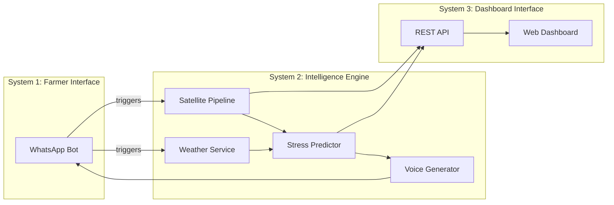
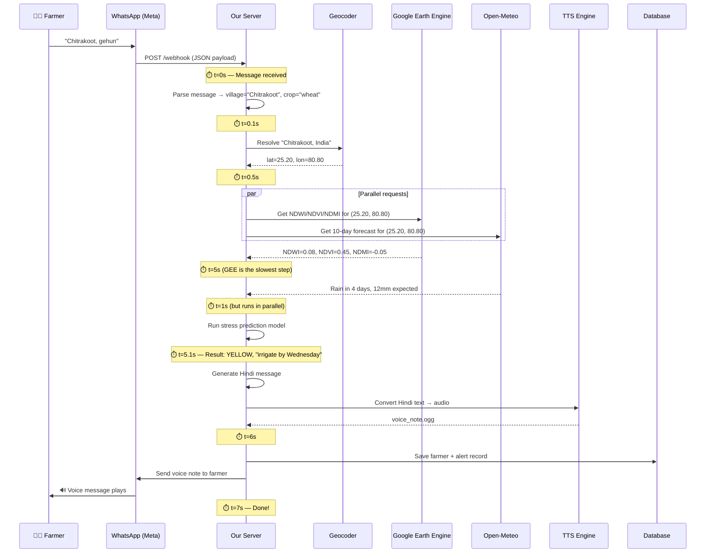
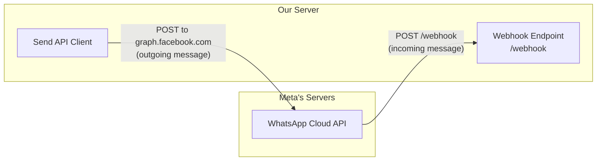
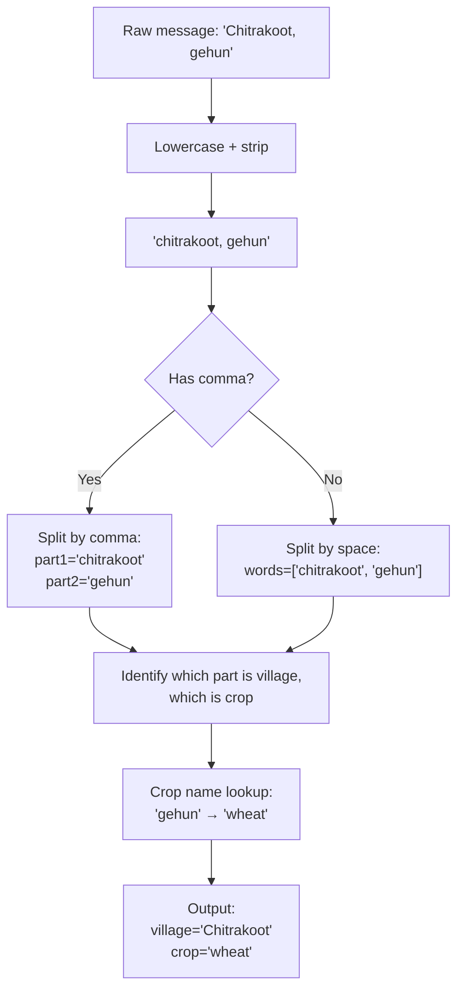
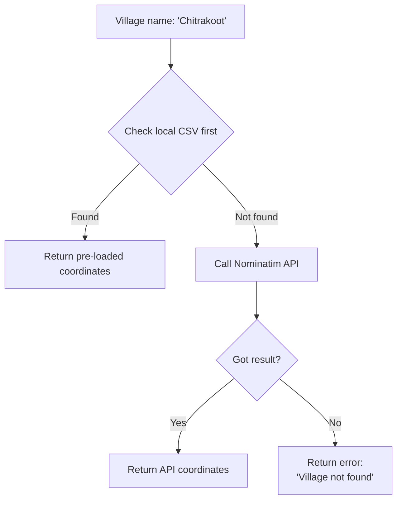
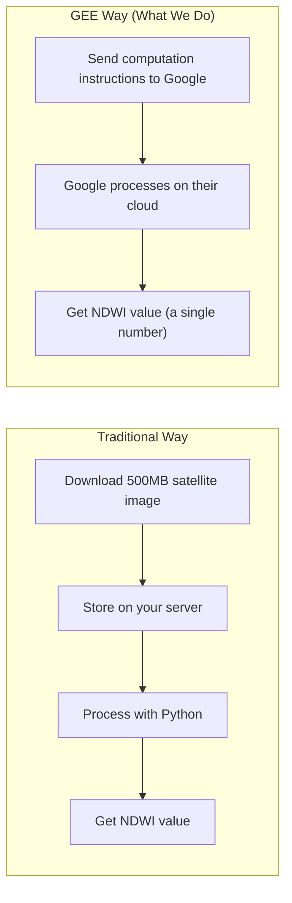
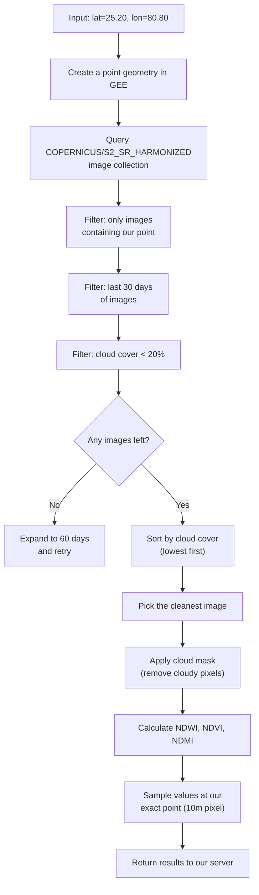
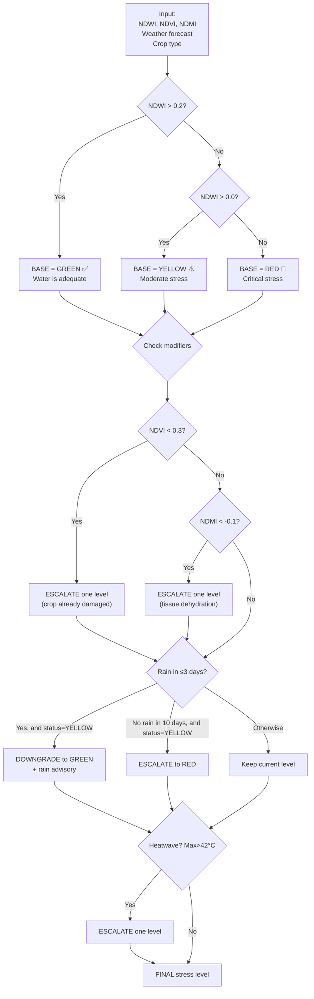
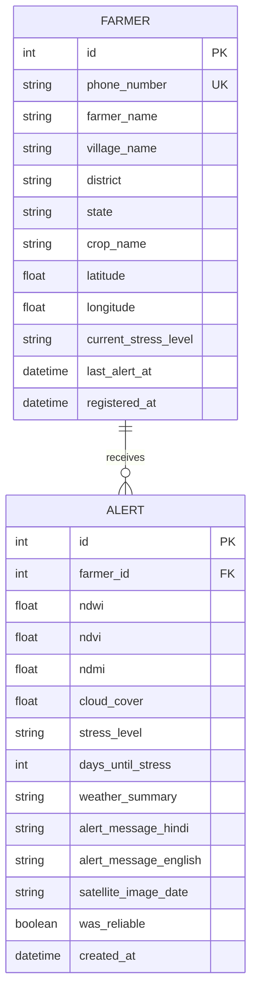
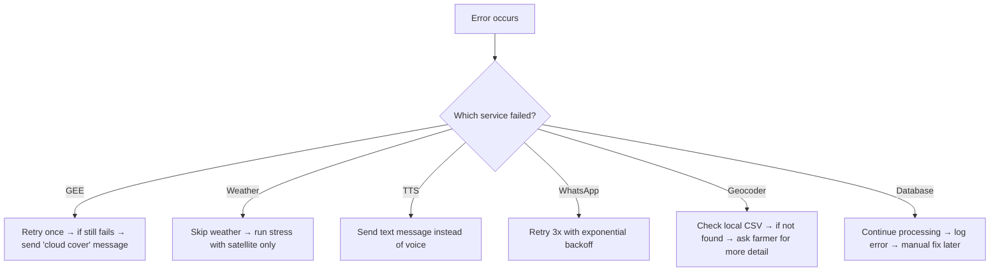

# JalSense 2.0 — Complete Backend Framework Blueprint

> This document explains **everything** about how the backend works — from the moment a farmer types a WhatsApp message to the moment they hear a voice note in Hindi. No code, no hand-waving. Every step, every decision, every "why."

---

## Table of Contents

1. [The Big Picture — What Are We Actually Building?](#1-the-big-picture)
2. [The Complete Request Lifecycle — Step by Step](#2-the-complete-request-lifecycle)
3. [Layer 1: WhatsApp Bot — How Messages Come In and Go Out](#3-layer-1-whatsapp-bot)
4. [Layer 2: Message Parser — Understanding Hindi Farmer Input](#4-layer-2-message-parser)
5. [Layer 3: Geocoder — Village Name to GPS Coordinates](#5-layer-3-geocoder)
6. [Layer 4: Satellite Pipeline — The Brain (GEE + Sentinel-2)](#6-layer-4-satellite-pipeline)
7. [Layer 5: Weather Service — 10-Day Forecast](#7-layer-5-weather-service)
8. [Layer 6: Stress Prediction Engine — The Decision Maker](#8-layer-6-stress-prediction-engine)
9. [Layer 7: TTS Voice Generator — Hindi Voice Notes](#9-layer-7-tts-voice-generator)
10. [Layer 8: Database — What We Store and Why](#10-layer-8-database)
11. [Layer 9: Dashboard API — Powering the Website](#11-layer-9-dashboard-api)
12. [The Technology Stack — What and Why](#12-the-technology-stack)
13. [Failure Modes — What Can Go Wrong](#13-failure-modes)
14. [Security & Secrets Management](#14-security--secrets-management)
15. [Complete Data Flow Trace — A Real Example](#15-complete-data-flow-trace)

---

## 1. The Big Picture

JalSense is **three systems bolted together**:



**System 1 (WhatsApp Bot)** is the farmer's door in. It receives messages and sends voice notes. The farmer never sees anything else.

**System 2 (Intelligence Engine)** is the brain. It takes a village name, pulls satellite data, checks weather, predicts stress, and generates a Hindi voice note. The farmer never knows this exists.

**System 3 (Dashboard API)** serves the website. Judges, agri-companies, and insurers use this. Farmers never touch it.

All three systems share **one database** and **one backend server**. The backend is a single Python application running on a single server.

---

## 2. The Complete Request Lifecycle

Here's **exactly** what happens when a farmer sends "Chitrakoot, gehun" on WhatsApp, measured in seconds:



**Total time: ~7 seconds** from message sent to voice note received.

The bottleneck is Google Earth Engine (3–8 seconds). Everything else is under 1 second each.

---

## 3. Layer 1: WhatsApp Bot

### How WhatsApp Bots Actually Work

WhatsApp bots don't work like normal chat apps. You don't "connect" to WhatsApp and listen for messages. Instead, it uses a **webhook** system:



**Incoming messages**: Meta calls YOUR server. When a farmer sends a message, Meta's servers make an HTTP POST request to a URL you registered (e.g., `https://your-server.com/webhook`). The request body contains the farmer's phone number, message text, and metadata as JSON.

**Outgoing messages**: YOU call Meta's server. To send a reply, you make an HTTP POST to `https://graph.facebook.com/v21.0/{PHONE_NUMBER_ID}/messages` with your access token.

### What You Need to Set Up (One-Time)

1. **Meta Business Account** — register at developers.facebook.com
2. **WhatsApp Business App** — create one in the Meta dashboard
3. **Phone Number** — register a phone number for your bot
4. **Access Token** — Meta gives you this; it authenticates your API calls
5. **Webhook URL** — your server's public URL that Meta will call

### The Webhook Payload — What Meta Sends Us

When a farmer sends "Chitrakoot, gehun", Meta sends this JSON to our `/webhook`:

```json
{
  "object": "whatsapp_business_account",
  "entry": [{
    "changes": [{
      "value": {
        "messages": [{
          "from": "917679144006",
          "type": "text",
          "text": { "body": "Chitrakoot, gehun" },
          "timestamp": "1718025600"
        }],
        "contacts": [{
          "profile": { "name": "Raju Kumar" },
          "wa_id": "917679144006"
        }]
      }
    }]
  }]
}
```

We extract three things:
- **Phone number**: `917679144006` (to reply back)
- **Message text**: `"Chitrakoot, gehun"` (to process)
- **Sender name**: `"Raju Kumar"` (to store)

### Sending a Voice Note Back

To send a voice note, it's a 2-step process:

**Step 1** — Upload the audio file to Meta's media server:
```
POST https://graph.facebook.com/v21.0/{PHONE_NUMBER_ID}/media
Body: multipart form-data with the .ogg file
Response: { "id": "media_id_12345" }
```

**Step 2** — Send the media message:
```
POST https://graph.facebook.com/v21.0/{PHONE_NUMBER_ID}/messages
Body: {
  "messaging_product": "whatsapp",
  "to": "917679144006",
  "type": "audio",
  "audio": { "id": "media_id_12345" }
}
```

The farmer receives the voice note in their WhatsApp chat — exactly like receiving a voice message from a friend.

### Webhook Verification (One-Time)

When you first register your webhook URL with Meta, they send a GET request to verify you own the server:

```
GET /webhook?hub.mode=subscribe&hub.verify_token=YOUR_SECRET&hub.challenge=RANDOM_STRING
```

Your server must check `hub.verify_token` matches your secret and return `hub.challenge`. This happens once during setup.

---

## 4. Layer 2: Message Parser

### The Problem

Farmers will type messages in wildly inconsistent formats:
- `"Chitrakoot, gehun"` (clean comma-separated Hindi)
- `"chitrakoot gehun"` (no comma, lowercase)
- `"Rampur wheat"` (English crop name)
- `"मेरा गांव रामपुर है गेहूं उगाता हूं"` (full Hindi sentence)
- `"rampur, gehu"` (misspelled crop)
- `"CHITRAKOOT WHEAT"` (all caps)

### How We Parse It

The parser works in stages:



**Crop name lookup table** — We maintain a dictionary:

| Hindi / Informal | English (Internal) |
|---|---|
| gehun, gehu, गेहूं | wheat |
| dhan, chawal, धान, चावल | rice |
| makka, makki, मक्का | maize |
| chana, चना | chickpea |
| soybean, सोयाबीन | soybean |
| kapas, कपास | cotton |
| sarson, सरसों | mustard |
| arhar, अरहर, toor | pigeon pea |

If we can't identify the crop, we reply with a text message: "Kripya apna gaon aur fasal ka naam bhejein. Jaise: Rampur, gehun"

### Edge Cases We Handle

| Scenario | Input | Handling |
|---|---|---|
| Only village, no crop | "Rampur" | Reply asking for crop name |
| Only crop, no village | "gehun" | Reply asking for village name |
| Gibberish | "asdfgh" | Reply with usage instructions |
| Repeat registration | Same farmer, same village | Update existing record, run fresh analysis |
| New crop, same farmer | Same farmer, different crop | Update crop, re-analyze |

---

## 5. Layer 3: Geocoder

### What It Does

Converts a village name like "Chitrakoot" into GPS coordinates: `latitude=25.20, longitude=80.80`.

### How It Works Internally

We use **two strategies** in sequence:



**Strategy 1 — Local CSV (fast, reliable for demo)**

We maintain a CSV file with pre-verified coordinates for demo villages:

```
village_name,district,state,latitude,longitude
Chitrakoot,Chitrakoot,Uttar Pradesh,25.1979,80.8322
Rampur,Rampur,Uttar Pradesh,28.7930,79.0250
Yavatmal,Yavatmal,Maharashtra,20.3899,78.1307
Rajnandgaon,Rajnandgaon,Chhattisgarh,21.0976,81.0283
Ranchi,Ranchi,Jharkhand,23.3441,85.3096
Banda,Banda,Uttar Pradesh,25.4753,80.3365
Jhansi,Jhansi,Uttar Pradesh,25.4484,78.5685
```

**Strategy 2 — Nominatim API (OpenStreetMap, for unknown villages)**

If the village isn't in our CSV, we call:
```
GET https://nominatim.openstreetmap.org/search?q=Chitrakoot,+India&format=json&limit=1
```

Response:
```json
[{
  "lat": "25.1979",
  "lon": "80.8322",
  "display_name": "Chitrakoot, Chitrakoot District, Uttar Pradesh, India"
}]
```

### Why Two Strategies?

- **Local CSV** = guaranteed accuracy for demo villages. No API call, no network dependency, instant response.
- **Nominatim** = covers any village in India. But it's free and community-run, so it can be slow (1-2 seconds) and occasionally returns wrong locations for very small villages.

### The Ambiguity Problem

India has multiple villages with the same name. "Rampur" exists in UP, HP, MP, Rajasthan, etc. Our approach:
1. First check local CSV (which includes district/state for disambiguation)
2. For Nominatim, we always append ", India" and take the first result
3. For Round 2: ask the farmer for their district if the village name is ambiguous

---

## 6. Layer 4: Satellite Pipeline (The Core)

This is the most important and complex part. Let me explain it thoroughly.

### What Is Google Earth Engine (GEE)?

GEE is NOT a normal API where you send a request and get data back. It's a **cloud computing platform** that lets you process satellite imagery on Google's servers.

Think of it like this:



We never download satellite images. We tell GEE "compute NDWI for this point" and it does all the heavy lifting on Google's servers. We only receive the final numbers.

### What Is Sentinel-2?

Sentinel-2 is a pair of satellites launched by the European Space Agency. They orbit Earth and take photos every **5 days** at **10-meter resolution** (each pixel = 10m × 10m of land).

The photos aren't normal RGB photos. Each image captures **13 spectral bands**:

| Band | Name | Wavelength | What It Captures |
|------|------|-----------|-----------------|
| B2 | Blue | 490nm | Water, atmosphere |
| B3 | Green | 560nm | Vegetation reflectance |
| B4 | Red | 665nm | Chlorophyll absorption |
| B8 | NIR (Near-Infrared) | 842nm | Vegetation health, water boundary |
| B11 | SWIR (Short-Wave IR) | 1610nm | Soil/vegetation moisture |
| B12 | SWIR 2 | 2190nm | Geology, moisture |

Human eyes see bands B2, B3, B4 (blue, green, red). Satellites see **invisible wavelengths** like near-infrared (B8) and short-wave infrared (B11) that reveal water content and plant health — things completely invisible to the naked eye.

### How We Calculate the Three Indices

Each index is a **ratio** of two bands. The formula isolates a specific property:

#### NDWI — Normalized Difference Water Index
```
NDWI = (B3 - B8) / (B3 + B8)
     = (Green - NIR) / (Green + NIR)
```

**What it measures**: Water content in the soil and crop canopy.
- Green light reflects strongly off water surfaces.
- NIR light is absorbed by water.
- So when water is present: B3 is high, B8 is low → NDWI is positive.

| NDWI Value | Meaning |
|-----------|---------|
| > 0.3 | Standing water / waterlogged field |
| 0.1 to 0.3 | Adequate soil moisture |
| 0.0 to 0.1 | Moderate water deficit |
| < 0.0 | Dry soil, water stress |

**This is the MOST important index for JalSense** — it directly tells us if the field needs water.

#### NDVI — Normalized Difference Vegetation Index
```
NDVI = (B8 - B4) / (B8 + B4)
     = (NIR - Red) / (NIR + Red)
```

**What it measures**: How green and healthy the vegetation is.
- Healthy plants absorb red light (for photosynthesis) and strongly reflect NIR.
- So healthy crops: B8 is high, B4 is low → NDVI is high.

| NDVI Value | Meaning |
|-----------|---------|
| 0.6 to 0.9 | Dense healthy vegetation |
| 0.3 to 0.6 | Moderate vegetation / growing crop |
| 0.1 to 0.3 | Sparse vegetation / stressed crop |
| < 0.1 | Bare soil / dead crop |

**Used as a cross-check** — if NDWI says "moderate stress" but NDVI says "crop is healthy", the stress might be early-stage and not yet affecting the plant.

#### NDMI — Normalized Difference Moisture Index
```
NDMI = (B8 - B11) / (B8 + B11)
     = (NIR - SWIR) / (NIR + SWIR)
```

**What it measures**: Moisture content within plant tissue (leaves, stems).
- NIR reflects from plant cell structure.
- SWIR is absorbed by water in plant tissue.
- So well-hydrated plants: B8 is high, B11 is low → NDMI is high.

| NDMI Value | Meaning |
|-----------|---------|
| > 0.2 | Well-hydrated vegetation |
| 0.0 to 0.2 | Mild moisture stress in tissues |
| -0.2 to 0.0 | Moderate tissue dehydration |
| < -0.2 | Severe dehydration, crop at risk |

**Complements NDWI** — NDWI measures water in the soil/canopy, NDMI measures water inside the plant itself. A plant can have dry soil (low NDWI) but still be okay if it has deep roots (NDMI still okay). But if NDMI drops, the plant is actively suffering.

### The GEE Pipeline — Step by Step

Here's exactly what happens inside our satellite module:



### Why `S2_SR_HARMONIZED`?

There are multiple Sentinel-2 datasets in GEE:
- `COPERNICUS/S2` — raw top-of-atmosphere reflectance (includes atmospheric distortion)
- `COPERNICUS/S2_SR` — surface reflectance (atmosphere corrected) ✅
- `COPERNICUS/S2_SR_HARMONIZED` — same as SR but with consistent band scaling across years ✅✅

We use **HARMONIZED** because it ensures our index calculations give consistent values whether the image is from 2024 or 2026.

### Cloud Cover — Why It Matters

Satellites take photos from space. **Clouds block the view**. If a cloud is sitting over the farmer's field, the satellite sees the cloud, not the field. Any NDWI/NDVI/NDMI calculated from cloudy pixels is garbage.

Our approach:
1. **Pre-filter**: Only accept images where overall cloud cover < 20%
2. **Pixel-level masking**: Even in a "low cloud" image, individual cloudy pixels are masked using the QA60 band (a special band that flags cloudy pixels)
3. **Reliability flag**: If cloud cover is above 20%, we flag the result as `is_reliable = false` and tell the farmer "we'll check again in a few days"

### Cloud Masking — How QA60 Works

Every Sentinel-2 image includes a special band called `QA60`. Each pixel in this band is a bitmask:
- Bit 10 = 1 → pixel is covered by an **opaque cloud**
- Bit 11 = 1 → pixel is covered by a **cirrus cloud** (thin, high-altitude)

We mask out (ignore) any pixel where either bit is set. This ensures we only compute indices from clear-sky pixels.

### What Happens If No Clean Image Exists?

In monsoon season (June–September), clouds can persist for weeks. Our fallback strategy:

1. **Expand date range** from 30 to 60 days
2. If still nothing → use the **last known values** from our database and add a disclaimer
3. If never analyzed before → tell the farmer "satellite imagery unavailable due to cloud cover, we'll alert you when a clear image is available"

### GEE Authentication — Two Modes

**Development (your laptop)**: Interactive auth. Run `ee.Authenticate()`, a browser opens, you log in with your Google account. This stores a token locally.

**Production (server)**: Service account auth. You create a GCP service account, download its JSON key file, and initialize GEE with:
```
credentials = ee.ServiceAccountCredentials(email, key_file)
ee.Initialize(credentials, project='your-project-id')
```
No browser needed. Fully automated.

---

## 7. Layer 5: Weather Service

### Why Weather Matters

Satellite data tells us the **current state** of the field. Weather tells us the **future**. Together, they predict stress **before it happens**.

Example scenarios:

| Current State (Satellite) | Weather Forecast | Alert |
|---|---|---|
| NDWI=0.15 (moderate) | No rain for 10 days | ⚠️ "Stress coming in 5 days, irrigate NOW" |
| NDWI=0.15 (moderate) | Heavy rain in 2 days | ✅ "Hold irrigation, rain coming Thursday" |
| NDWI=0.05 (low) | 42°C heatwave coming | 🔴 "Critical — irrigate immediately" |
| NDWI=0.30 (good) | Normal conditions | ✅ "Field is healthy, no action needed" |

Without weather, we'd send the same alert for scenarios 1 and 2 — which would make the farmer irrigate right before rain. That wastes water and money.

### Open-Meteo API — How It Works

Open-Meteo is a **free, no-API-key** weather service. You just call:

```
GET https://api.open-meteo.com/v1/forecast
  ?latitude=25.20
  &longitude=80.80
  &daily=precipitation_sum,temperature_2m_max,temperature_2m_min,precipitation_probability_max
  &timezone=Asia/Kolkata
  &forecast_days=10
```

Response (simplified):

```json
{
  "daily": {
    "time": ["2026-06-10", "2026-06-11", ..., "2026-06-19"],
    "precipitation_sum": [0.0, 0.0, 0.0, 12.5, 8.3, 0.0, ...],
    "temperature_2m_max": [41.2, 42.0, 40.8, 36.5, 35.0, ...],
    "precipitation_probability_max": [5, 10, 15, 85, 70, 20, ...]
  }
}
```

### What We Extract From the Response

| Field | How We Calculate It | Why We Need It |
|---|---|---|
| `days_until_rain` | First day where `precipitation_sum > 2mm` | To tell farmer "rain in X days, hold irrigation" |
| `total_rain_7_days` | Sum of precipitation for next 7 days | To assess if natural rainfall will cover crop needs |
| `max_temp_3_days` | Maximum of `temperature_2m_max` for next 3 days | To detect heatwave (>42°C) which accelerates water loss |
| `rain_dates` | All dates where `precipitation_sum > 2mm` | To tell farmer specific dates when rain is expected |

### Why Open-Meteo and Not IMD?

Your original plan mentioned IMD (India Meteorological Department). Here's the comparison:

| | Open-Meteo | IMD |
|---|---|---|
| API availability | Open REST API, no key needed | No public API; data is on website only |
| Coverage | Global, any lat/long | India-only, district-level |
| Forecast range | 16 days | 5–7 days |
| Cost | Free (non-commercial) | Free but scraping required |
| Integration effort | 5 minutes | Would need web scraping — fragile, slow |

**Verdict**: Use Open-Meteo for Round 1. If judges ask about IMD, say "we use Open-Meteo which aggregates multiple weather models including data sources that cover India. IMD integration is planned for Round 2."

---

## 8. Layer 6: Stress Prediction Engine

This is where satellite + weather + crop knowledge combine into an actionable alert.

### The Decision Matrix



### Real Example Walkthrough

**Input**:
- NDWI = 0.08 (between 0.0 and 0.2 → BASE = YELLOW)
- NDVI = 0.45 (> 0.3 → crop still alive, no escalation)
- NDMI = -0.05 (> -0.1 → tissue okay, no escalation)
- Rain: 12mm expected in 4 days (> 3 days, so no downgrade)
- Max temp: 38°C (< 42°C, no heatwave)

**Result**: YELLOW ⚠️
- `days_until_stress` = 5 (estimated based on NDWI trend)
- `irrigate_by` = "Wednesday" (today + 3 days, before stress gets critical)
- `rain_advisory` = "Rain expected Saturday — if you irrigate Wednesday, use less water"

### How `days_until_stress` Is Estimated

We use a simple linear model based on NDWI:

```
Daily water depletion rate = 0.03 (typical for Indian summer)
Days until NDWI hits 0.0 = current_NDWI / depletion_rate

Example: NDWI = 0.08 → 0.08 / 0.03 = 2.7 days → ~3 days until critical
```

Adjustments:
- If temperature > 35°C → depletion rate increases to 0.04 (hot days = faster water loss)
- If rain coming → effective depletion rate decreases
- If crop is at flowering stage (Round 2) → stress threshold is lower (plants more sensitive)

### Hindi Message Templates

Based on the final stress level, we fill in a template:

**GREEN (No stress)**:
> "Namaskar! Aapke khet mein pani ki sthiti acchi hai. Abhi sinchai ki zaroorat nahi hai. Hum 5 din baad phir check karenge."

**YELLOW (Moderate stress)**:
> "Namaskar! Aapke khet mein agle {X} din mein pani ki kami ho sakti hai. {Day} tak sinchai karein. {rain_note}"

Where `{rain_note}` can be:
> "Lekin {rain_day} ko baarish ki sambhavna hai, isliye kam paani mein sinchai karein."

**RED (Critical stress)**:
> "Namaskar! Aapke khet mein pani ki gambhir kami hai! Turant sinchai karein. Fasal ko nuksan ho sakta hai."

**RAIN OVERRIDE (Rain coming, hold irrigation)**:
> "Namaskar! Aapke khet ko sinchai ki zaroorat hai, lekin {rain_day} ko {rain_mm}mm baarish aane wali hai. Sinchai rok kar rakhein."

**UNRELIABLE DATA (Cloudy satellite)**:
> "Namaskar! Badal ke kaaran satellite se aapke khet ki photo saaf nahi mili. Hum jald hi dubara check karenge aur aapko batayenge."

---

## 9. Layer 7: TTS Voice Generator

### Why Voice, Not Text?

The target user is a 50-year-old farmer who:
- May not read Hindi fluently (especially younger generation farmers read Romanized Hindi but older ones may struggle with complex text)
- Is working in the field — easier to listen than read
- Trusts voice messages more (they sound personal, like a phone call from someone who cares)

### How gTTS Works

**gTTS (Google Text-to-Speech)** is a free Python library that uses Google Translate's TTS endpoint.

```
Input:  "Aapke khet mein pani ki kami ho sakti hai"
Output: voice_note.mp3 (audio file)
```

Internally:
1. gTTS sends the text to `translate.google.com/translate_tts`
2. Google's servers synthesize the audio
3. Returns an MP3 audio stream
4. We save it as a file

### Audio Format for WhatsApp

WhatsApp accepts audio messages in these formats:
- **OGG with Opus codec** (preferred — smaller file, plays as voice note with waveform UI)
- MP3 (plays as audio attachment, not voice note)
- AAC

To get the "voice note" UI (with the green waveform), we should convert to OGG/Opus:

```
MP3 (from gTTS) → Convert to OGG/Opus → Upload to WhatsApp
```

We use `pydub` library for conversion (requires `ffmpeg` installed on the server).

### TTS Fallback Strategy

| Priority | Method | Quality | Speed | Cost | GPU? |
|----------|--------|---------|-------|------|------|
| 1 (default) | gTTS | Robotic but clear | ~1s | Free | No |
| 2 (Round 2) | AI4Bharat IndicF5 | Near-human | ~3s | Free | Yes |
| 3 (fallback) | Text message | N/A | Instant | Free | No |

For Round 1, gTTS is perfect. The voice sounds slightly robotic but is completely understandable in Hindi. The farmer will not care — they care about the information, not the voice quality.

---

## 10. Layer 8: Database

### What We Store

We need to persist two things: **who our farmers are** and **what alerts we sent them**.



### Why This Schema?

**Farmer table** — One row per unique phone number. If the same farmer messages again, we UPDATE their row (new crop, new analysis). The `current_stress_level` field is what the dashboard map uses for the green/yellow/red dots.

**Alert table** — Every analysis we run creates an alert record. This gives us:
- **History**: Dashboard can show "last 10 alerts" for any farmer
- **Trends**: We can track if a field's NDWI is declining over time
- **Audit**: If a farmer says "you told me to irrigate but it rained", we have the record of exactly what data we had

### Why SQLite?

| | SQLite | PostgreSQL |
|---|---|---|
| Setup | Zero — just a file on disk | Need to install, configure, manage |
| Good for | Demo, hackathon, < 10K farmers | Production, 100K+ farmers |
| Concurrent access | Single writer at a time | Many simultaneous writers |
| Backup | Copy one file | `pg_dump` |

For a hackathon demo, SQLite is perfect. The entire database is a single file (`jalsense.db`). No installation, no configuration, no server to manage. If you want PostgreSQL later, we change one line (the `DATABASE_URL` in `.env`).

---

## 11. Layer 9: Dashboard API

The web dashboard (built separately as a frontend) needs data. Our backend exposes these REST API endpoints:

### Endpoints

| Method | URL | Purpose | Response |
|--------|-----|---------|----------|
| `GET` | `/api/farmers` | Map + farmer feed | List of all farmers with their lat/long, crop, stress level |
| `GET` | `/api/farmers/{id}` | Farmer detail | Single farmer + their alert history |
| `GET` | `/api/stats` | Overview stats | Total farmers, count by stress level, alerts today |
| `POST` | `/api/demo` | Live demo panel | Runs full pipeline for a village+crop, returns all intermediate data |
| `GET` | `/health` | Health check | Server status, GEE connection status |

### The Live Demo Endpoint — Key for Judges

`POST /api/demo` is special. It does everything the WhatsApp bot does, but instead of sending a voice note, it returns **all intermediate results** as JSON:

```json
{
  "input": {
    "village": "Chitrakoot",
    "crop": "wheat"
  },
  "geocoding": {
    "latitude": 25.20,
    "longitude": 80.80,
    "resolved_name": "Chitrakoot, Uttar Pradesh, India",
    "source": "local_csv"
  },
  "satellite": {
    "ndwi": 0.08,
    "ndvi": 0.45,
    "ndmi": -0.05,
    "cloud_cover": 12.3,
    "image_date": "2026-06-07",
    "is_reliable": true,
    "interpretation": {
      "ndwi": "Moderate water deficit",
      "ndvi": "Healthy growing crop",
      "ndmi": "Mild tissue moisture stress"
    }
  },
  "weather": {
    "days_until_rain": 4,
    "total_rain_7_days": 20.5,
    "max_temp_3_days": 38.2,
    "daily_forecast": [
      {"date": "2026-06-10", "precip": 0.0, "temp_max": 38.2},
      {"date": "2026-06-11", "precip": 0.0, "temp_max": 37.5},
      ...
    ]
  },
  "stress_prediction": {
    "level": "yellow",
    "days_until_stress": 5,
    "irrigate_by": "Wednesday, June 12",
    "rain_advisory": "Rain expected Saturday (12mm). Use less water if irrigating.",
    "confidence": "high"
  },
  "alert": {
    "hindi": "Namaskar! Aapke khet mein agle 5 din mein pani ki kami ho sakti hai. Budhwar tak sinchai karein. Shaniwar ko baarish ki sambhavna hai.",
    "english": "Your field may face water stress in 5 days. Irrigate by Wednesday. Rain expected Saturday."
  },
  "processing_time_seconds": 6.2
}
```

This JSON is what the dashboard's "Live Demo Panel" displays step by step — showing judges exactly how the pipeline works.

### CORS (Cross-Origin Resource Sharing)

The dashboard website runs on a different domain/port than the backend API. Browsers block cross-origin requests by default. We add CORS middleware to allow the dashboard to call our API:

```
Allow origins: ["http://localhost:3000", "https://jalsense-dashboard.vercel.app"]
Allow methods: ["GET", "POST"]
```

---

## 12. The Technology Stack

| Component | Technology | Why This One |
|-----------|-----------|-------------|
| **Web Framework** | FastAPI (Python) | Async by default, auto-generates API docs, typed, modern |
| **Satellite Data** | Google Earth Engine + Sentinel-2 | Free, 10m resolution, 5-day revisit, cloud processing |
| **Weather** | Open-Meteo API | Free, no API key, 10-day forecast, reliable |
| **Geocoding** | Nominatim (OSM) + local CSV | Free, no API key, covers India villages |
| **Database** | SQLite + SQLAlchemy | Zero setup, perfect for demo, ORM for clean code |
| **TTS** | gTTS | Free, Hindi support, no GPU needed |
| **WhatsApp** | Meta Cloud API | Official API, supports voice notes, webhook system |
| **Audio Conversion** | pydub + ffmpeg | MP3 → OGG conversion for WhatsApp voice notes |
| **Config** | python-dotenv + Pydantic Settings | Type-safe config, secrets in .env |

### Why FastAPI Over Flask?

| | FastAPI | Flask |
|---|---|---|
| Async support | Built-in (GEE + weather calls run in parallel) | Needs extensions |
| Type validation | Automatic via Pydantic | Manual |
| API docs | Auto-generated at `/docs` (Swagger UI) | Manual |
| Performance | ~3x faster | Baseline |
| Modern Python | Type hints, dataclasses, async/await | Optional |

FastAPI is the clear winner for this project because we need **async parallel calls** (GEE + weather simultaneously) and **auto-generated API docs** (impressive for judges).

### Why Python?

Every external service we use has a first-class Python SDK:
- `earthengine-api` (official GEE SDK)
- `geopy` (geocoding)
- `gTTS` (text-to-speech)
- `sqlalchemy` (database)

Building this in JavaScript/Node.js would mean fighting against non-existent or poorly maintained SDKs.

---

## 13. Failure Modes — What Can Go Wrong

| Failure | Impact | Our Response |
|---------|--------|-------------|
| GEE returns no image (all cloudy) | Can't calculate indices | Reply: "Cloud cover too high, we'll check again in 2 days" |
| GEE timeout (> 30s) | Farmer waits too long | Timeout after 15s, reply: "Processing is taking longer. We'll send your alert shortly." Then process in background. |
| Village name not found | Can't geocode | Reply: "Gaon ka naam nahi mila. Kripya district ke saath bhejein. Jaise: Rampur, Rampur District" |
| Open-Meteo down | No weather data | Run stress prediction with satellite data only (skip weather modifiers) |
| WhatsApp API error | Can't send reply | Log the error, retry 3 times with backoff |
| gTTS fails | Can't generate voice | Send text message as fallback instead of voice note |
| Database error | Can't save records | Process and reply anyway, log error for manual recovery |
| Farmer sends non-text (photo, video) | Can't parse | Reply: "Kripya apna gaon aur fasal ka naam text mein bhejein" |

### Error Recovery Flow



---

## 14. Security & Secrets Management

### What Secrets We Have

| Secret | What It Is | Risk If Leaked |
|--------|----------|---------------|
| `WHATSAPP_ACCESS_TOKEN` | Meta API token | Attacker can send messages as our bot |
| `GEE_KEY_FILE` | GCP service account key | Attacker can use our GEE quota |
| `WHATSAPP_VERIFY_TOKEN` | Webhook verification secret | Attacker can register fake webhooks |
| `DATABASE_URL` | Database connection string | For SQLite: it's just a file path, low risk |

### How We Manage Them

1. **Never committed to Git** — all secrets go in `.env` file which is in `.gitignore`
2. **Template provided** — `.env.example` shows what variables are needed, without actual values
3. **Loaded at startup** — `python-dotenv` reads `.env` and `pydantic Settings` validates them
4. **Server deployment** — use platform's secrets manager (Railway secrets, Render env vars, etc.)

### Webhook Security

Meta signs every webhook request with a SHA-256 HMAC. We should verify this signature to ensure the request actually came from Meta and not an attacker:

```
Signature = HMAC-SHA256(app_secret, request_body)
Compare with: X-Hub-Signature-256 header
```

This prevents someone from calling our `/webhook` with fake messages.

---

## 15. Complete Data Flow Trace — A Real Example

Let's trace exactly what happens when farmer Raju in Chitrakoot sends "Chitrakoot, gehun" on WhatsApp at 10:00 AM on June 10, 2026.

### 10:00:00 — Farmer sends message
Raju opens WhatsApp, types "Chitrakoot, gehun", hits send.

### 10:00:01 — Meta receives message
Meta's WhatsApp servers receive the message and look up which webhook URL is registered for our bot's phone number.

### 10:00:01.5 — Meta calls our webhook
Meta sends a POST request to `https://our-server.com/webhook` with JSON payload containing Raju's phone number and message text.

### 10:00:01.6 — We parse the message
Our server extracts:
- `phone = "917679144006"`
- `raw_message = "Chitrakoot, gehun"`
- Parser splits by comma: `village = "Chitrakoot"`, `crop_raw = "gehun"`
- Crop lookup: `"gehun"` → `"wheat"`

### 10:00:01.8 — We geocode the village
Check local CSV first → "Chitrakoot" found → `lat=25.1979, lon=80.8322`
(If not in CSV → call Nominatim API → takes 0.5-1s)

### 10:00:02.0 — We fire two parallel requests

**Request 1 — Google Earth Engine:**
- Create point geometry at (25.1979, 80.8322)
- Query Sentinel-2 collection for last 30 days
- 4 images available, 2 have < 20% cloud cover
- Select cleanest image (June 7, 2026, 8% cloud cover)
- Calculate NDWI = 0.08, NDVI = 0.45, NDMI = -0.05
- This takes **4.5 seconds** (network round-trip to Google)

**Request 2 — Open-Meteo:**
- GET forecast for (25.1979, 80.8322), next 10 days
- Response: No rain for 3 days, then 12mm on June 14, 8mm on June 15
- This takes **0.3 seconds**

### 10:00:06.5 — Satellite response arrives (the slower one)

### 10:00:06.6 — We run stress prediction
- NDWI = 0.08 → BASE = YELLOW (between 0.0 and 0.2)
- NDVI = 0.45 → no escalation (> 0.3, crop alive)
- NDMI = -0.05 → no escalation (> -0.1, tissue okay)
- Rain in 4 days → no downgrade (> 3 days)
- No rain for next 3 days → don't downgrade
- Max temp = 38°C → no heatwave escalation
- **FINAL = YELLOW ⚠️**
- days_until_stress = NDWI / depletion_rate = 0.08 / 0.03 = ~3 days
- irrigate_by = June 10 + 2 days = "Wednesday, June 12"
- rain_note = "Saturday ko 12mm baarish aa sakti hai"

### 10:00:06.7 — We generate Hindi message
```
"Namaskar! Aapke khet mein agle 3 din mein pani ki kami ho sakti hai. 
Budhwar tak sinchai karein. Shaniwar ko baarish ki sambhavna hai, 
isliye sinchai mein kam paani ka upyog karein."
```

### 10:00:06.8 — We generate voice note
- gTTS converts Hindi text → MP3 (0.8 seconds)
- pydub converts MP3 → OGG/Opus (0.1 seconds)
- Voice note file: `alert_917679144006_20260610.ogg` (size: ~45KB)

### 10:00:07.7 — We save to database
- Check if farmer exists with phone `917679144006`
  - If new → INSERT into `farmer` table
  - If existing → UPDATE `current_stress_level` to "yellow"
- INSERT alert record with all values

### 10:00:07.8 — We upload audio to Meta
- POST multipart form-data to `graph.facebook.com/.../media`
- Response: `media_id = "12345"`

### 10:00:08.0 — We send voice note to Raju
- POST to `graph.facebook.com/.../messages` with `media_id`
- Meta delivers the voice note to Raju's WhatsApp

### 10:00:08.5 — Raju receives a voice note 🔊
He taps play and hears:

> "Namaskar! Aapke khet mein agle teen din mein pani ki kami ho sakti hai. Budhwar tak sinchai karein. Shaniwar ko baarish ki sambhavna hai, isliye sinchai mein kam paani ka upyog karein."

**Total time: ~8.5 seconds** from send to receive.

---

## Summary — The Foolproof Checklist

Everything in the backend is **7 layers stacked on top of each other**:

| Layer | Does What | Depends On | Fails If |
|-------|----------|-----------|---------|
| **1. WhatsApp Webhook** | Receives & sends messages | Meta Business Account | Token expired, webhook URL down |
| **2. Message Parser** | Extracts village + crop | Crop lookup table | Gibberish input |
| **3. Geocoder** | Village → lat/long | Local CSV + Nominatim | Unknown village name |
| **4. Satellite Pipeline** | Lat/long → NDWI/NDVI/NDMI | GEE account + Sentinel-2 | All images cloudy |
| **5. Weather Service** | Lat/long → 10-day forecast | Open-Meteo API | API down (rare) |
| **6. Stress Engine** | Satellite + Weather → alert | Layers 4 + 5 | Bad thresholds (tune over time) |
| **7. TTS + Delivery** | Hindi text → voice note | gTTS + WhatsApp | gTTS down → fallback to text |

Each layer is **independent and testable on its own**. You can test the satellite pipeline without WhatsApp. You can test the stress engine with hardcoded values. You can test TTS with any Hindi text. This modular design means any single failure doesn't crash the whole system — every layer has a fallback.

That's the entire framework, end to end, inside out. 🎯
